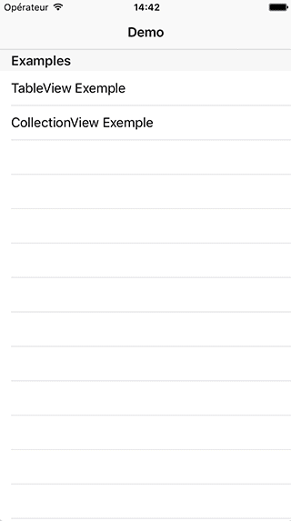

# AListViewController

[](https://travis-ci.org/Arnoymous/AListViewController)
[](http://cocoapods.org/pods/AListViewController)
[](http://cocoapods.org/pods/AListViewController)
[](http://cocoapods.org/pods/AListViewController)




## Features
- configure `TableView` or `CollectionView` with same methods
- manage sections and rows easly and animatly
- pullToRefresh and loadMore

## Installation

AListViewController is available through [CocoaPods](http://cocoapods.org). To install
it, simply add the following line to your Podfile:

```ruby
pod "AListViewController"
pod "AListViewController/PullToRefresh" #pullToRefresh feature
```

## Requirements

Swift 3.0

## How it work ?

AListViewController have two subclasses :
- `ATableViewController`
- `ACollectionViewController`

The only difference between thoses subclasses is the `ListView`: 
- UITableView for `ATableViewController`
- UICollectionView for `ACollectionViewController`

### Usage

`public func refreshData(reload: Bool, immediately: Bool)`
- reload: true - replace `ListView` content with `fetchSourceObjects` 
      - immediately: true
          - Immediately makes the `ListView` empty.
      - immediately: false
          - Refreshes the tableView after fetching the data.
- reload: false - append `fetchSourceObjects` to `ListView` content  

`public var fetchSourceObjects: ((@escaping([[Any]],Bool) -> Void) -> Void)`
- Fetch data in this closure.
- Call completion closure to return these information.
    - The fetched new objects (sourceObjects).
    - If the next loading exists (hasNext).
    
`public var configureCellIdentifier: ((IndexPath,Any)->String)`
- Configure cell identifier at IndexPath

`public var configureCell: ((IndexPath,Any,UITableViewCell) -> UITableViewCell)`

`public var configureCell: ((IndexPath,Any,UICollectionViewCell) -> UICollectionViewCell)!`
- Update cell at IndexPath

`public var didSelectCell: ((IndexPath,Any,UITableViewCell?) -> Void)?`

`public var didSelectCell: ((IndexPath,Any,UICollectionViewCell?) -> Void)?`
- Handle press on cell

## Example

```swift
import AListViewController

class ExampleTableViewController: ATableViewController {

    let section0 = ["Cell 1 Section 1","Cell 2 Section 1"]
    let section1 = ["Cell 1 Section 2","Cell 2 Section 2"]

    override func viewDidLoad() {
        self.configureCellIdentifier = { _, object in
            return "cell"
        }
        self.configureCell = { _,object,cell in
           cell.textLabel?.text = object as? String
           return cell
        }
        self.fetchSourceObjects = { completion in
           completion([self.section0,self.section1], true)
        }
        self.didSelectCell = { _,object,_ in
            print("select: \(object as! String)")
        }
        super.viewDidLoad()
    }

    func tableView(_ tableView: UITableView, titleForHeaderInSection section: Int) -> String? {
        return "Section \(section)"
    }
}
```

In this exemple the `UITableView` is linked in your storyboard and you have a prototype cell with "cell" as identifier.
If you call `refreshData(reload: true)` the content of your `ListView` don't change.

But if you call `refreshData(reload: false)` :
- `self.section0` is add to section at index 0
- `self.section1` is add to section at index 1

Now, 
- section at index 0 now contains `["Cell 1 Section 1","Cell 2 Section 1","Cell 1 Section 1","Cell 2 Section 1"]`
- section at index 0 now contains `["Cell 1 Section 2","Cell 2 Section 2","Cell 1 Section 2","Cell 2 Section 2"]`

## Additional Usage
```swift

public var pullToRefreshEnabled: Bool
public var loadMoreEnabled: Bool

public var fetchSourceObjectsOnViewDidLoad: Bool
public var rowAnimationEnabled: Bool

public var tableViewRowAnimation: (delete: UITableViewRowAnimation, insert: UITableViewRowAnimation, reload: UITableViewRowAnimation)

open func addPullToRefresh(_ animator: ESRefreshProtocol & ESRefreshAnimatorProtocol)
open func addLoadMore(_ animator: ESRefreshProtocol & ESRefreshAnimatorProtocol)

public func registerCellClass(_ `class`:AnyClass,withIdentifier identifier: String)
public func registerCellNib(_ nib: UINib,withIdentifier identifier: String)

public func insertSection(withObject objects:[Any]...,at index: Int? = nil)
public func insertSections(withObjects objects:[[Any]],at index: Int? = nil)

public func deleteSection(withIndex indexs:Int...)
public func deleteSections(withIndexs indexs:[Int]? = nil)

public func reloadSection(withIndex indexs:Int...)
public func reloadSections(withIndexs indexs:[Int]? = nil)

public func insertRow(withObject object:Any,at indexPath:IndexPath? = nil)
public func insertRows(withObjects objects:[Any],at indexPaths:[IndexPath])

public func deleteRow(withIndex indexs: IndexPath...)
public func deleteRows(withIndexs indexs: [IndexPath])

public func reloadRow(withIndex indexs:IndexPath...)
public func reloadRows(withIndexs indexs:[IndexPath]? = nil)

public func object(atIndexPath indexPath: IndexPath) -> Any
```
## Author

Arnaud Dorgans, arnaud.dorgans@gmail.com

Inspired by mishimay, https://github.com/istyle-inc/LoadMoreTableViewController

## License

AListViewController is available under the MIT license. See the LICENSE file for more info.
